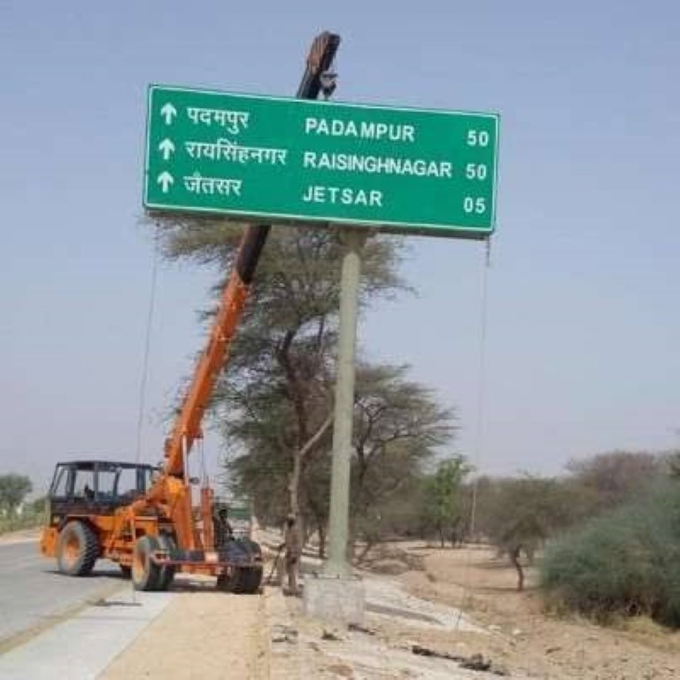
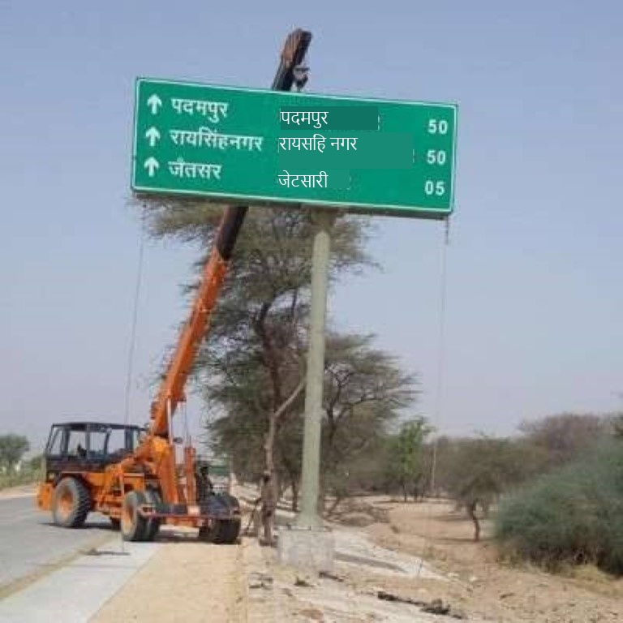

# Megathon-22 Shinchan

## What is this?
This repository contains a Python program to take an image as input, perform OCR to extract text from it, detect any particular language in it (or not), translate the text into English (or any other language of your choice), and overwrite the translated text in the image.

<!--  -->



For more details, please refer to the [full presentation](https://github.com/Aditya-Harikrish/Megathon22-Shinchan/blob/main/A_case_for_EVs_to_make_travels_more_accessible_removing_the_language_barrier_compressed.pdf)

## Setup

For the entire setup, please refer to Google Cloud's documentation of setting up Google Cloud Vision in Python. Download your API key, and name it `key.json` in the Megathon22-Shinchan directory. 

Some of the commands you may need to run are:
```sh
pip install google-cloud-vision     # for OCR
pip install googletrans==3.1.0a0    # for translation
pip install gTTS playsound=1.2.2    # for TTS and playing audio
pip install opencv-contrib-python   # for image processing
```

To run (with Python3):
```
python main.py
```